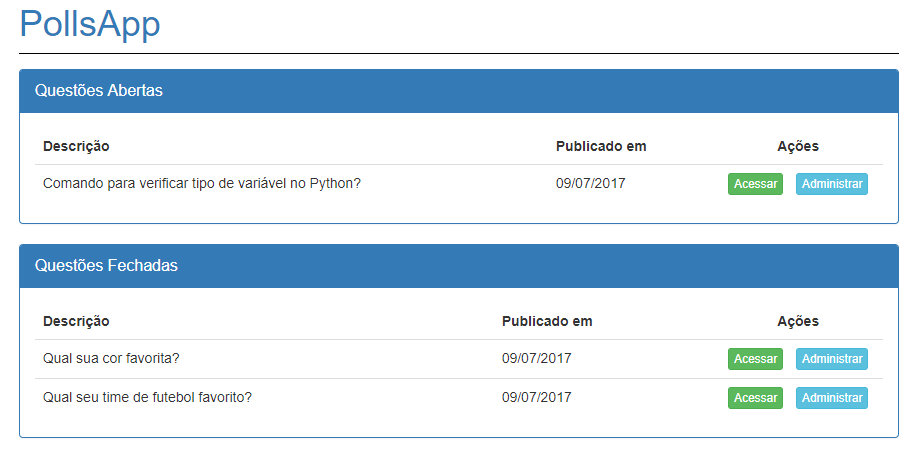
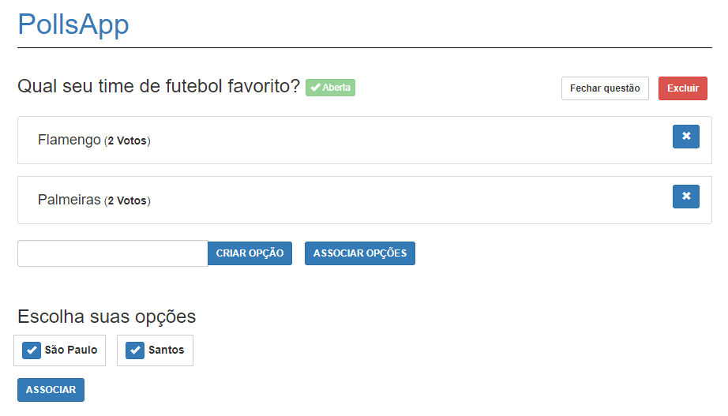
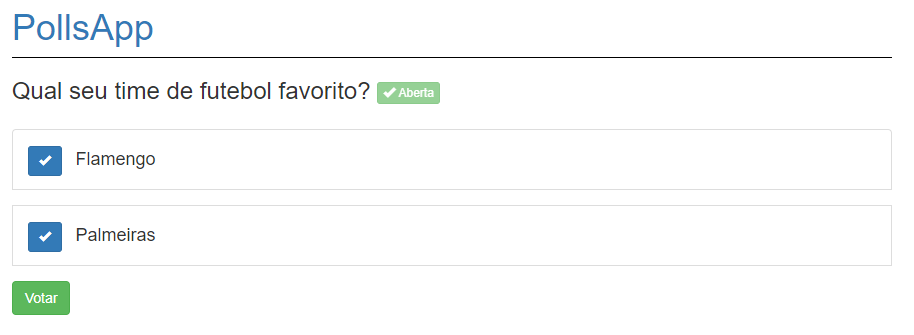
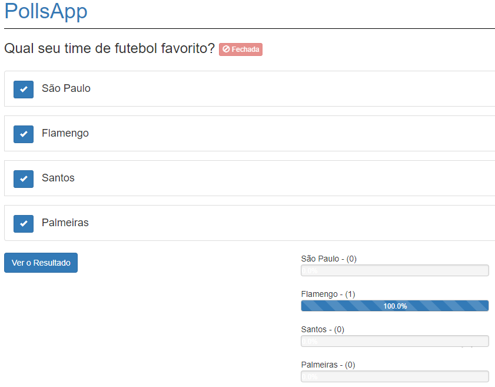

## Instruções

> Já existe um banco para testes local ( sqlite )

- Criar um ambiente virtual e ativá-lo
- Entrar na pasta do projeto e executar:

```
pip install -r requirements.txt
```

- Rodar as migrações e o migrate

```python
python manage.py makemigrations
python manage.py migrate
```

- Rodar o servidor local

```python
python manage.py runserver
```

## Funcionalidades

- Administração de opções ( remoção, adição) tudo via ajax
- Voto em opção via ajax com tooltip
- Visualizar resultado somente de questões fachadas
- Associar opções sem questão associada à questão em uso.
- Criação de opção via ajax

## Telas

- Listagem inicial



- Administração


- Visualização da questão individual para voto


- Visualização da questão fechada - resultado


